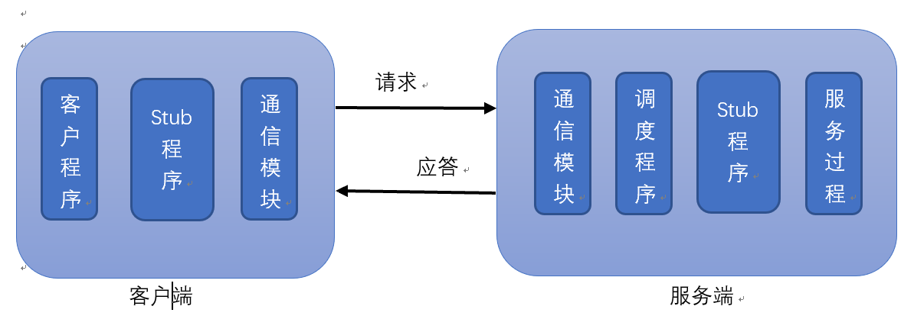

**RPC（Remote Procedure Communication,RPC)** 是一种常见的**分布式**网络通信协议，跨越了传输层和应用层，使得用户调用一个远程函数就像调用本地函数一样，用户不需要关心网络通信的细节，简化了用户的开发成本。典型的应用就包括Hadoop。

RPC一般采用的是Client&Server模型，一个典型的RPC框架包括：
**通信模块**：在服务器和客户端实现请求应答协议。一般分为同步和异步两种实现方式。

**Stub程序**：在服务器和客户端都包含Stub程序，作为一个代理程序。在客户端，用户调用远程函数时和在做本地调用一样，但是这个请求会通过网络发送到服务端，此外，在客户端收到服务端的应答之后，她还会对其进行解析。而且在服务端，它负责接收解码用户传送来的参数，调用相应的服务并将编码应答将结果返回。

**调度程序**：负责接收通信模块的请求消息并选择一个Stub程序对其进行处理。当请求很大时，会利用线程池进行。

**客户程序/服务过程**：请求的发出者和请求的处理者。

