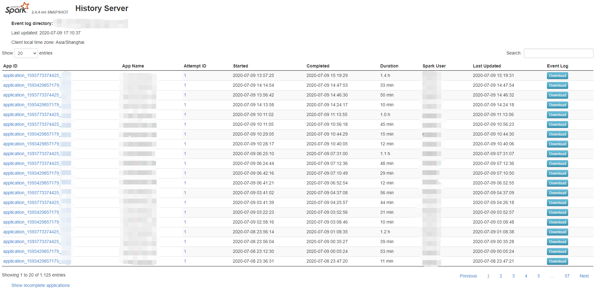
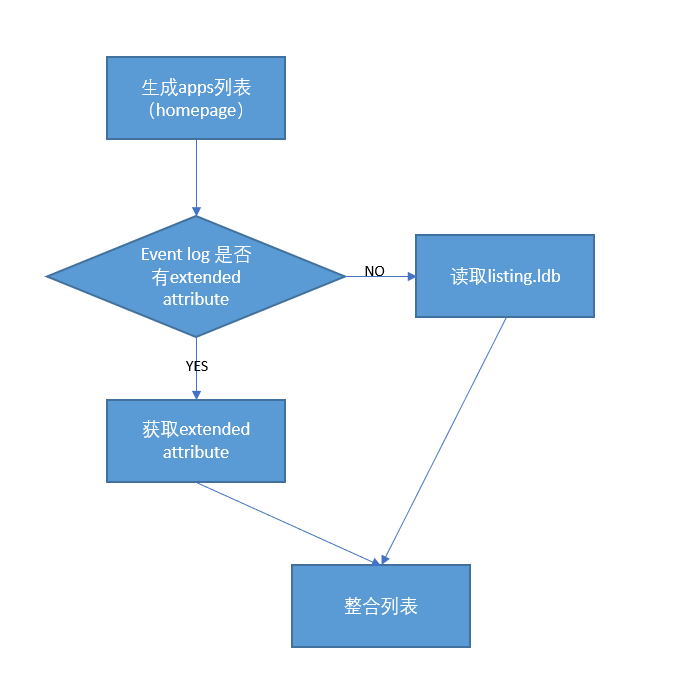

## Spark History Server的主页
Spark History Server(SHS) 主页展示了一定时间内（spark.history.fs.cleaner.maxAge, default 7d）的所有的application列表，包含了applicationId, name, attemptId, start time, end time, duration, user, eventlog下载链接。</br>



## SHS如何生成app列表
SHS是基于event log来生成application list，这就避免不了需要去SHS去读取和解析log。从代码里我们可以看到，需要解析：SparkListenerApplicationStart，SparkListenerApplicationEnd，SparkListenerEnvironmentUpdate，sparkVersion。
当application还是running的情况下，SHS并不需要读取到SparkListenerApplicationEnd就可以获取到需要的列表信息，因此只需要解析很少量的event log内容就可以完成。
但是对于结束的application，需要读取到end event才能获取结束时间，而我们不能保证event log的最后一条数据就是end event，所以在最早期的SHS是需要遍历完所有的event才能生成列表信息。而生成的列表信息会被缓存到levelDB中，对应为listing.ldb。

```scala
private[history] class AppListingListener(
    reader: EventLogFileReader,
    clock: Clock,
    haltEnabled: Boolean) extends SparkListener {

  private val app = new MutableApplicationInfo()
  private val attempt = new MutableAttemptInfo(reader.rootPath.getName(),
    reader.fileSizeForLastIndex, reader.lastIndex)

  private var gotEnvUpdate = false
  private var halted = false

  override def onApplicationStart(event: SparkListenerApplicationStart): Unit = {
    app.id = event.appId.orNull
    app.name = event.appName

    attempt.attemptId = event.appAttemptId
    attempt.startTime = new Date(event.time)
    attempt.lastUpdated = new Date(clock.getTimeMillis())
    attempt.sparkUser = event.sparkUser

    checkProgress()
  }

  override def onApplicationEnd(event: SparkListenerApplicationEnd): Unit = {
    attempt.endTime = new Date(event.time)
    attempt.lastUpdated = new Date(reader.modificationTime)
    attempt.duration = event.time - attempt.startTime.getTime()
    attempt.completed = true
  }

  override def onEnvironmentUpdate(event: SparkListenerEnvironmentUpdate): Unit = {
    // Only parse the first env update, since any future changes don't have any effect on
    // the ACLs set for the UI.
    if (!gotEnvUpdate) {
      def emptyStringToNone(strOption: Option[String]): Option[String] = strOption match {
        case Some("") => None
        case _ => strOption
      }

      val allProperties = event.environmentDetails("Spark Properties").toMap
      attempt.viewAcls = emptyStringToNone(allProperties.get(UI_VIEW_ACLS.key))
      attempt.adminAcls = emptyStringToNone(allProperties.get(ADMIN_ACLS.key))
      attempt.viewAclsGroups = emptyStringToNone(allProperties.get(UI_VIEW_ACLS_GROUPS.key))
      attempt.adminAclsGroups = emptyStringToNone(allProperties.get(ADMIN_ACLS_GROUPS.key))

      gotEnvUpdate = true
      checkProgress()
    }
  }

  override def onOtherEvent(event: SparkListenerEvent): Unit = event match {
    case SparkListenerLogStart(sparkVersion) =>
      attempt.appSparkVersion = sparkVersion
    case _ =>
  }

  def applicationInfo: Option[ApplicationInfoWrapper] = {
    if (app.id != null) {
      Some(app.toView())
    } else {
      None
    }
  }
```
而对于很多long running的job来说，例如streaming job, event log最后会非常的大，为了读取少量的列表信息而需要遍历全部的event log显然是没有效率的，于是SHS引入了快速进行解析的功能。前面我们说到，end event不一定是最后一行，但是肯定是在event log的末端部分出现，因此通过打开“spark.history.fs.inProgressOptimization.enabled”和设置“spark.history.fs.endEventReparseChunkSize”，我们可以开启快速解析功能。这个功能的原理就是，当application结束的时候，为了获取end evnet,我们会从最后“endEventReparseChunkSize”大小开始寻找end event。

```scala
val lookForEndEvent = shouldHalt && (appCompleted || !fastInProgressParsing)
    if (lookForEndEvent && listener.applicationInfo.isDefined) {
      val lastFile = logFiles.last
      Utils.tryWithResource(EventLogFileReader.openEventLog(lastFile.getPath, fs)) { in =>
        val target = lastFile.getLen - reparseChunkSize
        if (target > 0) {
          logInfo(s"Looking for end event; skipping $target bytes from $logPath...")
          var skipped = 0L
          while (skipped < target) {
            skipped += in.skip(target - skipped)
          }
        }

        val source = Source.fromInputStream(in).getLines()

        // Because skipping may leave the stream in the middle of a line, read the next line
        // before replaying.
        if (target > 0) {
          source.next()
        }

        bus.replay(source, lastFile.getPath.toString, !appCompleted, eventsFilter)
      }
    }

    logInfo(s"Finished parsing $logPath")
```

## SHS 提高性能
为了进一步的提高生成application list的速度，利用了HDFS的extend attribute功能。
</br> [SPARK-23607](https://issues.apache.org/jira/browse/SPARK-23607)</br>



### Spark Driver
Driver部分需要做的，就是在写event log的同时，为该log文件创建extended attribute。例如“user.startTime”。

### SHS
SHS需要做的，就是在生成list的时候，去拿去event log的extended attributes，这些attributes是存储在namenode内存中的，所以读取速度非常快。