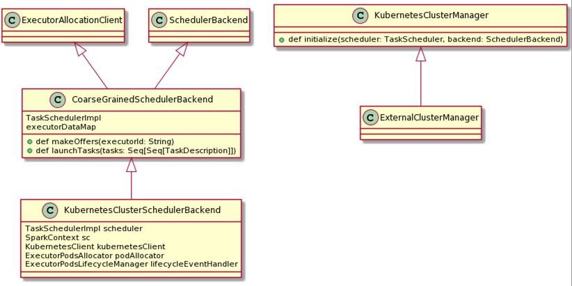

## Spark on K8s -- statefulset
我们知道现在已经release的spark版本中，spark on K8s的实现，是将driver和executor作为pod跑在K8s中，但是目前spark已经实现了将executor作为statefulsets跑在K8s中，只不过还处于开发阶段，有一些细节还在完善中。但是博主已经在自己的环境中尝试过了，已经可以成功的运行一个spark application，相信这个功能应该能很快上线。本文这里就针对这个功能的实现做一些介绍。
主要参考链接：[SPARK-36058][K8S]: https://github.com/apache/spark/pull/33508

## 测试样例
拉取最新的spark master branch的code，制作一个docker image, 这些步骤都比较简单，参考官网就可以完成：
```
1. ./build/mvn -Pkubernetes -DskipTests clean package
2. $ ./bin/docker-image-tool.sh  -t my-tag build
```
submit command:
``` shell
.\bin\spark-submit.cmd --master k8s://<master-url> --deploy-mode cluster --name spark-pi --class org.apache.spark.examples.SparkPi --conf spark.executor.instance=2 --conf spark.kubernetes.container.image=<docker image>  --conf spark.kubernetes.allocation.pods.allocator=replicaset --conf spark.kubernetes.authenticate.driver.serviceAccountName=spark local:///opt/spark/examples/jars/spark-examples_2.12-3.3.0-SNAPSHOT.jar 5000
```
通过执行kubectl 的一些命令，可以观察到，最终运行了一个driver pod和一个statefulset, 这个statefulset中有两个pod作为了executor。当job结束，statefulset就会被删除。

## 实现分析
这里我给出一个基础的UML图，很多东西都有省略，具体大家可以对照源码看。</br>
</br>

上图是已经release的spark版本的code，也就是将executor作为Pod直接跑在K8s上。为了实现statefulset, 开源社区做了一些扩展和改动。

从entrypoint.sh文件里我们可以看到，之前launch一个executor的class是CoarseGrainedExecutorBackend，现在改为了KubernetesExecutorBackend，这个作为在K8s上运行在executor上的backend。
``` shell
executor)
    shift 1
    CMD=(
      ${JAVA_HOME}/bin/java
      "${SPARK_EXECUTOR_JAVA_OPTS[@]}"
      -Xms$SPARK_EXECUTOR_MEMORY
      -Xmx$SPARK_EXECUTOR_MEMORY
      -cp "$SPARK_CLASSPATH:$SPARK_DIST_CLASSPATH"
      org.apache.spark.scheduler.cluster.k8s.KubernetesExecutorBackend
      --driver-url $SPARK_DRIVER_URL
      --executor-id $SPARK_EXECUTOR_ID
      --cores $SPARK_EXECUTOR_CORES
      --app-id $SPARK_APPLICATION_ID
      --hostname $SPARK_EXECUTOR_POD_IP
      --resourceProfileId $SPARK_RESOURCE_PROFILE_ID
      --podName $SPARK_EXECUTOR_POD_NAME
    )
    ;;
```
增加了一个abstract class AbstractPodsAllocator，这样就将来不管是以什么方式去allocate executor,只需要实现该类即可。
``` java
@DeveloperApi
abstract class AbstractPodsAllocator {
  /*
   * Set the total expected executors for an application
   */
  def setTotalExpectedExecutors(resourceProfileToTotalExecs: Map[ResourceProfile, Int]): Unit
  /*
   * Reference to driver pod.
   */
  def driverPod: Option[Pod]
  /*
   * If the pod for a given exec id is deleted.
   */
  def isDeleted(executorId: String): Boolean
  /*
   * Start hook.
   */
  def start(applicationId: String, schedulerBackend: KubernetesClusterSchedulerBackend): Unit
  /*
   * Stop hook
   */
  def stop(applicationId: String): Unit
}
```
然后我们主要关心的重点就是StatefulsetPodsAllocator这个class，这里就不把所有的code都粘贴进来，我们主要整理几个关键部分：

1. driver pod
这个部分其实就是根据driver pod name获取到driver pod, 因为我们在启动executor的时候，其实还需要有driver的相关信息。例如保证driver pod已经ready，获取driver service等。这在对executor pod build的时候非常有用。
``` java
private val kubernetesDriverPodName = conf
    .get(KUBERNETES_DRIVER_POD_NAME)

  val driverPod = kubernetesDriverPodName
    .map(name => Option(kubernetesClient.pods()
      .withName(name)
      .get())
      .getOrElse(throw new SparkException(
        s"No pod was found named $name in the cluster in the " +
          s"namespace $namespace (this was supposed to be the driver pod.).")))
```
2. build executor pod
executor build步骤我们需要查看KubernetesExecutorBuilder这个类，在这个类当中，完成了接受podtemplate(提交spark job的时候，通过配置可以有一个user pod template)，以及所以基本executor构建步骤。</br>
重点看一下features，在每一个features中都是对pod的配置添加。
``` java
val features = Seq(
      new BasicExecutorFeatureStep(conf, secMgr, resourceProfile),
      new ExecutorKubernetesCredentialsFeatureStep(conf),
      new MountSecretsFeatureStep(conf),
      new EnvSecretsFeatureStep(conf),
      new MountVolumesFeatureStep(conf),
      new LocalDirsFeatureStep(conf)) ++ userFeatures
```
3. build statefulset
当我们经过一些类对pod, container的构造配置，我们就相当于有了一个podtemplate,将其塞入到一个statefulset。
``` java
 val statefulSet = new io.fabric8.kubernetes.api.model.apps.StatefulSetBuilder()
        .withNewMetadata()
          .withName(setName(applicationId, resourceProfileId))
          .withNamespace(conf.get(KUBERNETES_NAMESPACE))
        .endMetadata()
        .withNewSpec()
          .withPodManagementPolicy("Parallel")
          .withReplicas(expected)
          .withNewSelector()
            .addToMatchLabels(SPARK_APP_ID_LABEL, applicationId)
            .addToMatchLabels(SPARK_ROLE_LABEL, SPARK_POD_EXECUTOR_ROLE)
            .addToMatchLabels(SPARK_RESOURCE_PROFILE_ID_LABEL, resourceProfileId.toString)
          .endSelector()
          .withTemplate(podTemplateSpec)
          .addAllToVolumeClaimTemplates(newNamedVolumes.asJava)
        .endSpec()
        .build()

      addOwnerReference(driverPod.get, Seq(statefulSet))
      kubernetesClient.apps().statefulSets().create(statefulSet)
      setsCreated += (resourceProfileId)
```
4. executor Id
executor pod allocator的方式中，executorId是在创建executor Pod的时候，通过AtomicInteger获取，因为Pod是一个一个创建的，所以可以直接为他们进行编号。executor和driver进行通信的时候，driver可以根据pod label获取到对应executorId。例如：spark-exec-id: "1"</br>
但是statefulset中executorId是driver动态生成的。在构造pod的时候，我们在pod label中设置了spark-exec-id: EXECID，用"EXECID"做一个template exec ID, 当spark-exec-id是这个template值的时候，会动态的分配一个exeId。
\resource-managers/kubernetes/core/src/main/scala/org/apache/spark/scheduler/cluster/k8s/KubernetesExecutorBackend.scala
``` java
val execId: String = arguments.executorId match {
        case null | "EXECID" | "" =>
          // We need to resolve the exec id dynamically
          driver.askSync[String](GenerateExecID(arguments.podName))
        case id =>
          id
      }
```
\resource-managers\kubernetes\core\src\main\scala\org\apache\spark\scheduler\cluster\k8s\KubernetesClusterSchedulerBackend.scala

``` java
private class KubernetesDriverEndpoint extends DriverEndpoint {
    private def generateExecID(context: RpcCallContext): PartialFunction[Any, Unit] = {
      case x: GenerateExecID =>
        val newId = execId.incrementAndGet().toString
        context.reply(newId)
        // Generally this should complete quickly but safer to not block in-case we're in the
        // middle of an etcd fail over or otherwise slower writes.
        val labelTask = new Runnable() {
          override def run(): Unit = Utils.tryLogNonFatalError {
            // Label the pod with it's exec ID
            kubernetesClient.pods()
              .withName(x.podName)
              .edit({p: Pod => new PodBuilder(p).editMetadata()
                .addToLabels(SPARK_EXECUTOR_ID_LABEL, newId.toString)
                .endMetadata()
                .build()})
          }
        }
        executorService.execute(labelTask)
    }
    private def ignoreRegisterExecutorAtStoppedContext: PartialFunction[Any, Unit] = {
      case _: RegisterExecutor if sc.isStopped => // No-op
    }

    override def receiveAndReply(context: RpcCallContext): PartialFunction[Any, Unit] =
      generateExecID(context).orElse(
        ignoreRegisterExecutorAtStoppedContext.orElse(
          super.receiveAndReply(context)))

    override def onDisconnected(rpcAddress: RpcAddress): Unit = {
      // Don't do anything besides disabling the executor - allow the Kubernetes API events to
      // drive the rest of the lifecycle decisions
      // TODO what if we disconnect from a networking issue? Probably want to mark the executor
      // to be deleted eventually.
      addressToExecutorId.get(rpcAddress).foreach(disableExecutor)
    }
  }
  ```
  ## 为啥是statefulset
  其实博主感觉用replicaset也是完全可以的，毕竟code author原话也是“Allocating individual pods in Spark can be not ideal for some clusters and using higher level operators like statefulsets and replicasets can be useful.”
  所以我就自己尝试实现使用replicaset来运行executor,最后也是成功了spark-pi的。只不过在BasicExecutorFeatureStep中，对每个pod设置了hostname="$executorPodNamePrefix-exec-${kubernetesConf.executorId}",并且executorId设置为了"EXECID",所以发生错误。于是我直接取消了设置hostname,毕竟replicaset会给每个pod设定name。
  至于开源社区为啥优先选择了statefulset,也许是看上了statefulset的固定网络标识和持久存储，以便于将来的更好的功能支持吧。


