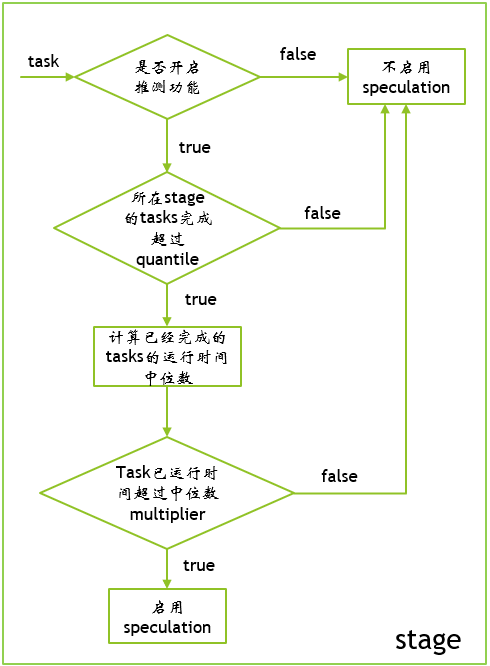

## 为什么需要speculation
我们都知道，Spark job中，一个stage什么时候完成，取决于stage下最后一个task的完成时间。task的完成时间也被很多因素影响，比如partition的分配，executor的资源使用情况，host的运行状态，集群网络等等。很多情况下因为运行环境导致的task跑的过慢，让task可以重新跑起来是可以缓解这个问题的，因此就Spark就启用了speculation（推测）功能。本文我们将来详细介绍下什么是spark的speculation。

## Spark.Speculation
在spark的configuration中，关于speculation的参数如下：</br>
|property name | default | meaning |
|-----|------|-----|
|spark.speculation|	false	| 如果设置为"true", 就会对tasks执行推测机制。就是说在一个stage下跑的慢的tasks将有机会被重新启动 |
|spark.speculation.interval|	100ms|	Spark检测tasks推测机制的间隔时间 |
|spark.speculation.multiplier|	1.5	| 一个task的运行时间是所有task的运行时间中位数的几倍（门限值）才会被认为该task需要重新启动 |
|spark.speculation.quantile|	0.75|	当一个stage下多少百分比的tasks运行完成才会开启推测机制|

我们注意到，推测机制都是基于一个stage下进行的，不同的stage下的task是不会相互影响的，针对的也是正在运行的task。当启动了推测执行后，spark会获取先完成的task结果并且将task标记为完成。

## Speculation工作流程
从spark关于speculation的配置参数，我们可以不难判断出spark的推测的工作流程。



## Spark源码
TaskScheduler的启动函数,在sparkContext初始化时被调用。
``` java 
override def start() {
    backend.start()

    if (!isLocal && conf.getBoolean("spark.speculation", false)) {
      logInfo("Starting speculative execution thread")
      speculationScheduler.scheduleWithFixedDelay(new Runnable {
        override def run(): Unit = Utils.tryOrStopSparkContext(sc) {
          checkSpeculatableTasks()
        }
      }, SPECULATION_INTERVAL_MS, SPECULATION_INTERVAL_MS, TimeUnit.MILLISECONDS)
    }
  }
```
在TaskSetManager中，检测需要启动speculation机制的task
``` java
/**
   * Check for tasks to be speculated and return true if there are any. This is called periodically
   * by the TaskScheduler.
   *
   */
override def checkSpeculatableTasks(minTimeToSpeculation: Int): Boolean = {
    // Can't speculate if we only have one task, and no need to speculate if the task set is a
    // zombie.
    if (isZombie || numTasks == 1) {
      return false
    }
    var foundTasks = false
    val minFinishedForSpeculation = (SPECULATION_QUANTILE * numTasks).floor.toInt
    logDebug("Checking for speculative tasks: minFinished = " + minFinishedForSpeculation)

    if (tasksSuccessful >= minFinishedForSpeculation && tasksSuccessful > 0) {
      val time = clock.getTimeMillis()
      val medianDuration = successfulTaskDurations.median
      val threshold = max(SPECULATION_MULTIPLIER * medianDuration, minTimeToSpeculation)
      // TODO: Threshold should also look at standard deviation of task durations and have a lower
      // bound based on that.
      logDebug("Task length threshold for speculation: " + threshold)
      for (tid <- runningTasksSet) {
        val info = taskInfos(tid)
        val index = info.index
        if (!successful(index) && copiesRunning(index) == 1 && info.timeRunning(time) > threshold &&
          !speculatableTasks.contains(index)) {
          logInfo(
            "Marking task %d in stage %s (on %s) as speculatable because it ran more than %.0f ms"
              .format(index, taskSet.id, info.host, threshold))
          speculatableTasks += index
          sched.dagScheduler.speculativeTaskSubmitted(tasks(index))
          foundTasks = true
        }
      }
    }
    foundTasks
  }
  ```
DAGScheduler中对task进行re-launch,这里利用了event机制进行。
``` java
  /**
   * Called by the TaskSetManager when it decides a speculative task is needed.
   */
  def speculativeTaskSubmitted(task: Task[_]): Unit = {
    eventProcessLoop.post(SpeculativeTaskSubmitted(task))
  }
```

