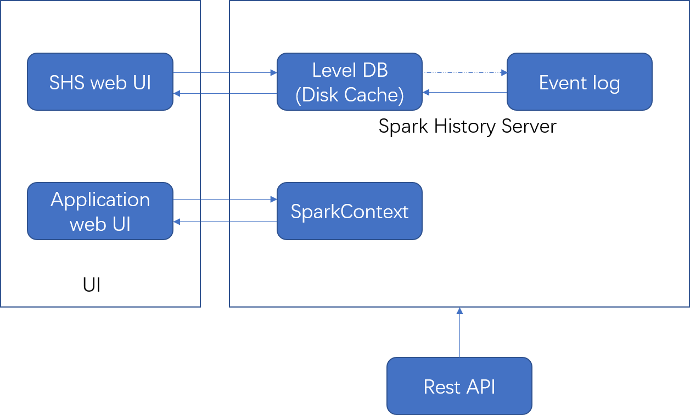
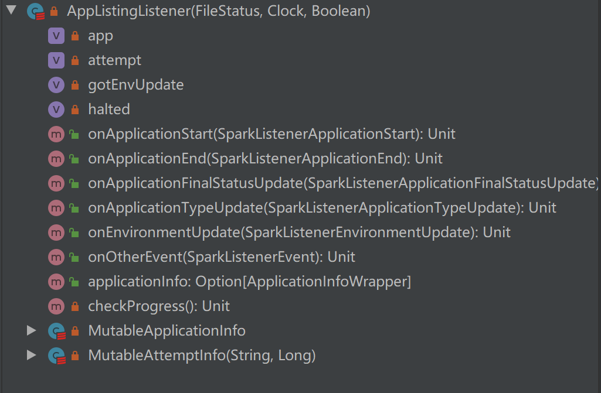

[前言](#前言) </br>
[Spark如何持久化event](#Spark如何持久化event) </br>
[SHS启动参数](##SHS启动参数) </br>
[SHS工作流程](#SHS工作流程) </br>
[DiskCache](#DiskCache) </br>
[读取eventlog](#读取eventlog) </br>
[参考](#参考) </br>

## 前言
这篇文章会overall的介绍一下Spark History Server和event log是如何一起工作的。Spark History Server(以下简称SHS)是一个用来debug 你的Spark applications的非常有用的工具，我相信熟悉Spark的对它都并不陌生。SHS是根据通过持久化application的运行过程中的所有events，通常是将定义的event写到一个HDFS的文件，这个文件就叫做event log。注意这个log和运行时产生的stdout/stderr不是一个概念的log。

## Spark如何持久化event
SHS并不是负责做event的持久化的，而是你的application在running的时候完成了event持久化。当你提交Spark job的时候，必须通过配置来启动event log并且指定你的log path是SHS读取的event log的path，这样你的job才会被SHS找到。
~~~
spark.eventLog.enabled true 
spark.eventLog.dir hdfs://namenode/shared/spark-logs
~~~

那么Spark会记录哪些event呢？我们先来看下SparkListenerEvent, 这是所有event的基类(当然Spark streaming的event没有直接继承SparkListenerEvent)。所有继承了这个类，并且没有把logEvent设置为false的event，都会被EventLoggingListener的logEvent函数以Json的形式写到了event log中，一行为一个event。

```scala
@DeveloperApi
@JsonTypeInfo(use = JsonTypeInfo.Id.CLASS, include = JsonTypeInfo.As.PROPERTY, property = "Event")
trait SparkListenerEvent {
  /* Whether output this event to the event log */
  protected[spark] def logEvent: Boolean = true
}
```
举个例子，在EventLoggingListener中，当收到SparkListenerStageSubmitted事件时，会执行onStageSubmitted函数，该函数调用了logEvent,将SparkListenerStageSubmitted转为Json并写入到event log中。

```scala
 /** Log the event as JSON. */
  private def logEvent(event: SparkListenerEvent, flushLogger: Boolean = false) {
    val eventJson = JsonProtocol.sparkEventToJson(event)
    // scalastyle:off println
    writer.foreach(_.println(compact(render(eventJson))))
    // scalastyle:on println
    if (flushLogger) {
      writer.foreach(_.flush())
      hadoopDataStream.foreach(_.hflush())
    }
    if (testing) {
      loggedEvents += eventJson
    }
  }

  // Events that do not trigger a flush
  override def onStageSubmitted(event: SparkListenerStageSubmitted): Unit = logEvent(event)
  ```
SparkContext初始化的时候会调用EventLoggingListener的start()函数，这个函数会为对应的application生成一个event log文件，文件名一般是{appId}_{attempId}，这个文件名最开始会有一个后缀".inprogress", 当application运行结束，会调用其stop()函数，将event log的".inprogress"去掉。SHS则通过这个来判断对应的application是incomplete还是complete。

## SHS启动参数
SHS启动时，有一个重要的参数"spark.history.fs.logDirectory",这个就是指定SHS读取event log路径的地方。还有一个参数需要特别注意"spark.history.store.path",这个参数是SHS的disk cache位置，如果没有设置，那SHS每收到一个请求都是从memory里读取数据，如果设置了，那么会把数据cache到该路径下，并且用levelDB进行存储。这个参数建议大家enable起来，不然对稍微大一点的application，每次从SHS那里加载都会非常的慢（我遇到过半个多小时甚至更久才加载出来的情况，因此接下来的介绍我都是按照有disk cache的情况来进行的，下文提到的levelDB都可以认为是这个disk cache）。其他还有一些关于的event log的删除，cache size，application数量等的参数，具体可以参考Apache Spark官网 [Monitoring](https://spark.apache.org/docs/latest/monitoring.html#spark-history-server-configuration-options).

## SHS工作流程



上图是一个非常简洁的流程，在这里我们区分了SHS和Application web UI,这两个最简单的理解方式，SHS会对多有的application都有效，并且即使application结束了之后也可存在，而application web UI则只存在running期间，并且是从SparkContext启动的一个UI。

## DiskCache
首先我们先明确一件事，SHS会维护一个listing，这个listing是一个Spark里定义的KVStore，里面存储的是所有的应该出现在SHS的application info（是个high level的applicaiton info），这个listing会对应到LevelDB的一个"listing.ldb"中。我们在SHS UI首页中的application list就是从"listing.ldb"中读取的。同时，每个application的LevelDB文件被放置在"apps"中，该文件夹下每个application对应一个{appId}_{attemptId}.ldb。当具体到特定的application的时候，就是从这里进行数据读取，里面会包含有stage，executor，task等的详细信息。SHS对于这两个KVStore的数据生成的基本思想是一致的，因此后文会针对listing来进行详细的说明。

## 读取eventlog
上文我们介绍过event是按照Json的方式记录到event log中，这里我们就来介绍SHS是如何读取文件并写入到LevelDB中的。
在FsHistoryProvider中有一个函数mergeApplicationListing，这里我只粘贴了相关的部分code。我们可以看到，EventLoggingListener.openEventLog(logPath, fs)这里实现了读取event log并且将其传入到SparkListenerBus的replay函数中。ReplayListenerBus，他是继承自SparkListenerBus，因此它可以根据event类型执行ReplayListenerBus中注册的listener的对应函数。为了更新listing，向其注册了一个AppListingListener。我们可以看到，这个listener只实现了特定的几个函数，并且只挑选出需要的event（val eventsFilter: ReplayEventsFilter）进行post。那是因为这个listener只需要解析application层面的信息，经过处理后，listing就被更新了。

```scala
/**
   * Replay the given log file, saving the application in the listing db.
   */
  protected def mergeApplicationListing(
      fileStatus: FileStatus,
      scanTime: Long,
      enableOptimizations: Boolean): Unit = {
    val eventsFilter: ReplayEventsFilter = { eventString =>
      eventString.startsWith(APPL_START_EVENT_PREFIX) ||
        eventString.startsWith(APPL_END_EVENT_PREFIX) ||
        eventString.startsWith(LOG_START_EVENT_PREFIX) ||
        eventString.startsWith(ENV_UPDATE_EVENT_PREFIX) ||
        eventString.startsWith(APPL_FINAL_STATUS_UPDATE_EVENT_PREFIX) ||
        eventString.startsWith(Type_UPDATE_EVENT_PREFIX)
    }

    val logPath = fileStatus.getPath()
    val appCompleted = isCompleted(logPath.getName())
    val reparseChunkSize = conf.get(END_EVENT_REPARSE_CHUNK_SIZE)

    // Enable halt support in listener if:
    // - app in progress && fast parsing enabled
    // - skipping to end event is enabled (regardless of in-progress state)
    val shouldHalt = enableOptimizations &&
      ((!appCompleted && fastInProgressParsing) || reparseChunkSize > 0)

    val bus = new ReplayListenerBus()
    val listener = new AppListingListener(fileStatus, clock, shouldHalt)
    bus.addListener(listener)

    logInfo(s"Parsing $logPath for listing data...")
    Utils.tryWithResource(EventLoggingListener.openEventLog(logPath, fs)) { in =>
      bus.replay(in, logPath.toString, !appCompleted, eventsFilter)
    }

```



简单总结下，SHS会根据event log中每一行的Json反序列化生成对应的event，这些event会被post到所有向ReplayListenerBus注册过的listener中执行对应的listing的更新，当listing更新完毕之后，会通过调用KVStore.write函数实现写入LevelDB。

## 参考：
Apache Spark: https://spark.apache.org/docs/latest/monitoring.html