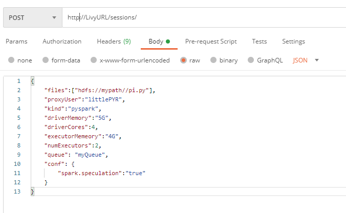
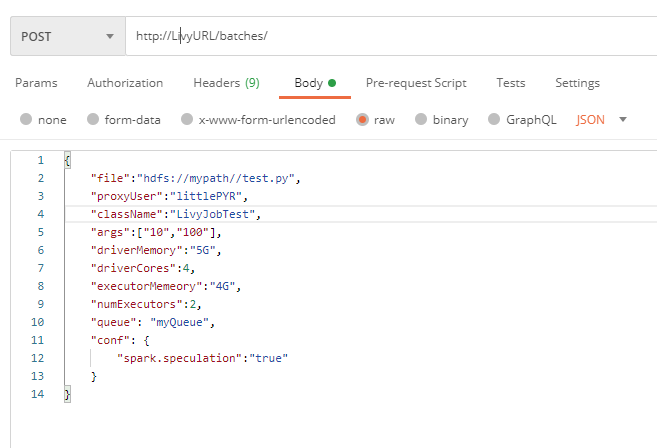

## Livy概述
用过Spark的朋友对Livy一定不陌生，Livy是Apache Spark下的一个REST服务，通过Livy，你只要可以发送Http请求，就可以提交Spark任务。Livy在很多Spark数据平台上都作为一个提交任务的重要工具，你可以不知道Livy是怎么工作的，但是你不能不知道Livy是如何使用的。这里我们重点介绍下如何使用Livy的REST API来提交Spark任务，当然首先你得对Spark submit有一定的了解，不然就先移步[Spark submit wiki](https://spark.apache.org/docs/latest/submitting-applications.html)。 

## Livy交互式的任务提
交互式的任务提交大家应该都不陌生，debug模式下我们一般都会用到这种方式来测试验证你的脚本逻辑。通俗点解释就是每次发送一条命令到Spark,就会就会收到Spark执行完这条命令的结果。在Livy中，一个交互式的spark任务，称作session。发送http post请求即可完成。 

Livy交互式提交的参数： 
|参数|类型|描述|
|----|----|----|
|kind|enum|session的类别，包括：spark, pyspark, sparkr or sql|
|proxyUser|string|session 管理者/拥有者|
|jars|string list|session 中需要的jar包|
|pyFiles|string list|session中的python文件|
|files|string list|session中依赖的文件|
|driverMemory|string|driver的memory,等同于--driver-memory/spark.driver.memory|
|driverCores|int|driver的core,等同于spark.driver.cores|
|executorMemory|string|executor的memory,等同于--executor-memory/spark.executor.memory|
|executorCores|int|executor的core,等同于spark.executor.cores|
|numExecutors|int|executor个数|
|archives|string list|压缩文件|
|queue|string|spark on yarn环境下，任务提交的yarn queue|
|name|string|session名字|
|conf|Map<key,value>|spark的configuration|
|heartbeatTimeoutInSecond|int|session超时时间，秒|

## Livy批处理的任务提交
批处理模式的任务提交，经常是用于可以上生产环境的任务提交。Spark和Livy都管这种类型叫做Batch任务。 
同样的，Livy也为Batch任务提供了REST API,只需要通过发送http post请求就可以提交你的Batch任务。
Livy Batch任务提交参数： 

|参数|类型|描述|
|----|----|----|
|file|path(required)|任务的可执行文件路径|
|proxyUser|string|任务管理者/拥有者|
|className|string|任务的Main class(Java/Spark)|
|args|string list|命令参数|
|pyFiles|string list|任务中的python文件|
|files|string list|任务依赖的文件|
|driverMemory|string|driver的memory,等同于--driver-memory/spark.driver.memory|
|driverCores|int|driver的core,等同于spark.driver.cores|
|executorMemory|string|executor的memory,等同于--executor-memory/spark.executor.memory|
|executorCores|int|executor的core,等同于spark.executor.cores|
|numExecutors|int|executor个数|
|archives|string list|压缩文件|
|queue|string|spark on yarn环境下，任务提交的yarn queue|
|name|string|session名字|
|conf|Map<key,value>|spark的configuration|

## 使用样例
### 样例一：Livy的交互式提交

### 样例二：Livy的批处理提交

## 总结
Livy的使用其实不仅限于以上提到的REST API，以上主要是介绍了如何提交，Livy还提供了丰富的REST API用于管理和监控你的任务。当然Livy也提供了丰富的API（Programmatic/Java/Scala）。感兴趣的可以直接阅读[Livy Apache官网](https://livy.apache.org/)。